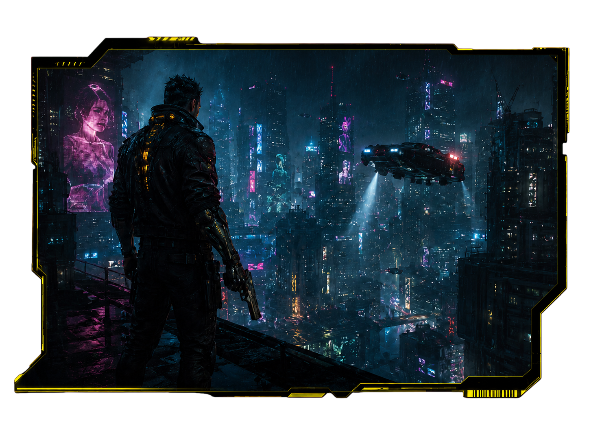

<div align="center">

# Cyberpunk 2077 — Night City Archive

### 나이트 시티 아카이브 · 비공식 한국어 리디자인 콘셉트

An interactive, framework-free fan landing page for *Cyberpunk 2077* — built from scratch with vanilla **HTML / CSS / JavaScript**.
사이버펑크 2077을 모티프로 한 **인터랙티브 리디자인 콘셉트**. 프레임워크 없이 순수 HTML/CSS/JS로 구현했습니다.

<br>


**[▶ Live Demo / 라이브 데모](https://jhc2265.github.io/cyberpunk2077/)**
<sub>(GitHub Pages 배포 후 활성화됩니다 / live once GitHub Pages is enabled)</sub>

<br>



</div>

---

## Overview · 개요

A single-page, interactive concept site themed around Night City. Visitors can explore the game's
world, city districts, and legendary characters through scroll-triggered reveals, autoplaying video,
and hover/touch-driven interactions — **no libraries, no build step, no dependencies.**

나이트 시티의 세계관 · 도시 구역 · 전설적 캐릭터를 스크롤 등장, 영상 자동재생, hover/터치 인터랙션으로
탐험하는 **단일 페이지 인터랙티브 콘셉트 사이트**입니다. 외부 라이브러리, 빌드 단계, 의존성이 전혀 없습니다.

> ⚠️ **Fan project / 팬 제작 학습용** — *Cyberpunk 2077* and all related IP belong to **CD PROJEKT RED**. Non-commercial.
> Cyberpunk 2077 및 관련 IP의 모든 권리는 CD PROJEKT RED에 있으며, 본 저장소는 상업적 목적이 아닙니다.

---

## Highlights · 핵심 포인트

What this project demonstrates — 이 프로젝트로 보여주는 것:

- **Zero-dependency front-end** — hand-written HTML/CSS/JS only. No React, no bundler, no `npm install`.
  의존성 0. 모든 인터랙션을 직접 구현.
- **Scroll & viewport interactions** — `IntersectionObserver`-driven reveal animations and video autoplay.
  `IntersectionObserver` 기반 스크롤 등장 애니메이션과 영상 자동재생.
- **Adaptive video playback** — hover-to-play on desktop, viewport-aware autoplay on touch devices (battery-friendly: pauses when off-screen).
  데스크톱은 hover 재생, 모바일은 화면에 보일 때만 자동재생 후 벗어나면 일시정지.
- **Interactive sliders & map** — character spotlight, world carousel, and a responsive district map with linked hotspots.
  캐릭터 스포트라이트 · 세계관 캐러셀 · 반응형 도시 지도(연동 핫스팟).
- **Fully responsive** — Grid/Flexbox with `aspect-ratio`, media queries, and full-bleed mobile layout.
  Grid/Flexbox · `aspect-ratio` · 미디어쿼리 기반 완전 반응형.
- **Production-minded details** — semantic markup, ARIA labels, Open Graph / Twitter cards, favicon, theme-color.
  시맨틱 마크업 · ARIA · OG/트위터 카드 · 파비콘 등 디테일까지.

---

## Sections · 주요 섹션

| Section | Description / 설명 |
| --- | --- |
| `#top` — Hero | Main visual + video. Autoplays in view on mobile. / 메인 비주얼·영상, 모바일 자동재생 |
| `#updates` | Latest update news cards / 최신 업데이트 뉴스 카드 |
| `#characters` | Legendary character spotlight / 전설적 캐릭터 스포트라이트 |
| `#world` | Lore carousel — Corporate · Cyberware · Badlands / 세계관 캐러셀 |
| `#districts` | City districts + interactive map / 도시 구역 + 인터랙티브 지도 |

---

## Tech Stack · 기술 스택

- **HTML5** — semantic markup / 시맨틱 마크업
- **CSS3** — Grid / Flexbox, `aspect-ratio`, media queries, masks & gradients
- **Vanilla JavaScript** — `IntersectionObserver`, sliders, auto-rotation, adaptive video
- **No dependencies / no build tools** — 의존성·빌드 도구 없음

---

## Run Locally · 로컬 실행

No build step required. / 별도 빌드 과정이 없습니다.

**Option 1 — open directly / 바로 열기**
Open `index.html` in a browser. (Some browsers limit local-file video/features.)
`index.html`을 브라우저로 바로 열기. (일부 브라우저는 로컬 파일에서 비디오 등이 제한될 수 있어요.)

**Option 2 — local server (recommended) / 로컬 서버 권장**

```bash
node server.mjs
# → http://127.0.0.1:4173   (tested on Node.js v22)
```

---

## Project Structure · 폴더 구조

```
.
├── index.html      # Markup / 페이지 본문
├── css/
│   └── style.css   # Styles + responsive layout / 전체 스타일·반응형
├── js/
│   └── main.js     # Interactions / 슬라이더·자동재생·스크롤 등장
├── assets/         # Images · video · icons / 이미지·영상·아이콘
├── server.mjs      # Local preview server (not needed for deploy) / 로컬 미리보기 전용
└── README.md
```

---

## Deploy · 배포 (GitHub Pages)

Static site — deploys straight to GitHub Pages. / 정적 사이트라 GitHub Pages로 바로 배포 가능합니다.

1. Push to GitHub / 저장소 푸시
2. **Settings → Pages → Build and deployment**
3. Source: **Deploy from a branch** → `main` / root (`/`)
4. Open the generated URL / 발급된 URL 접속

After deploying, replace the `og:url` / `og:image` tags in `index.html` with absolute URLs so social previews render correctly.
배포 후 `index.html`의 OG 태그를 실제 절대 URL로 교체하면 소셜 공유 미리보기가 정상 표시됩니다.

---

## License & Rights · 라이선스 / 권리

Unofficial fan concept for learning purposes. *Cyberpunk 2077*, its logo, characters, and world are
intellectual property of **CD PROJEKT RED**. The code here is for educational use — do not use the
bundled image/video assets commercially.

비공식 팬 콘셉트 학습 프로젝트입니다. *Cyberpunk 2077* 및 로고·캐릭터·세계관 등 모든 지식재산권은
**CD PROJ